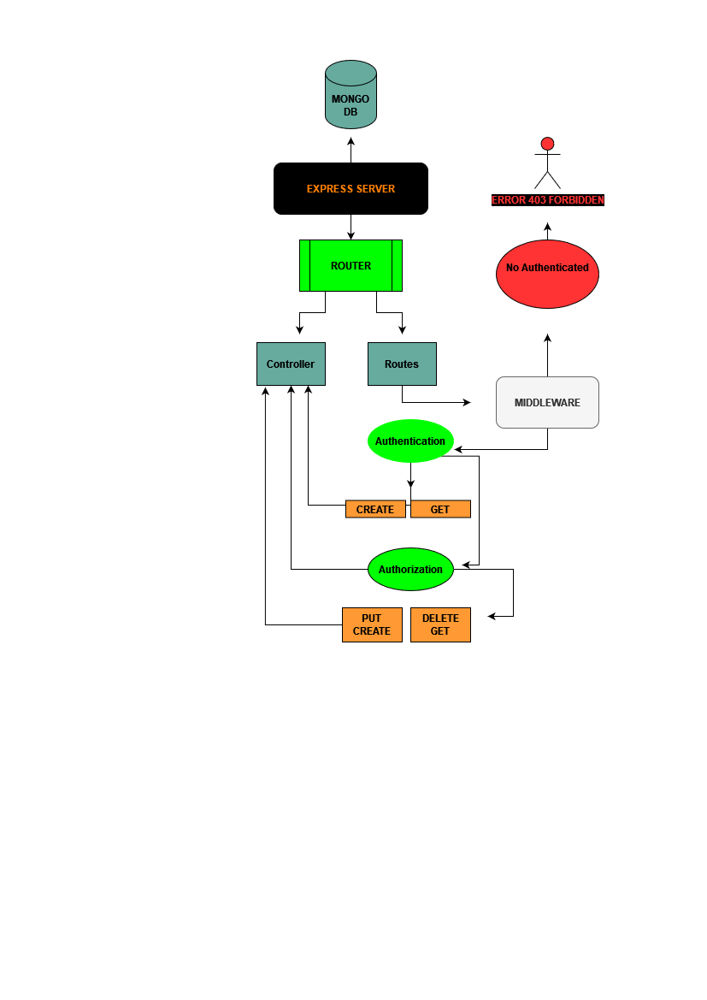
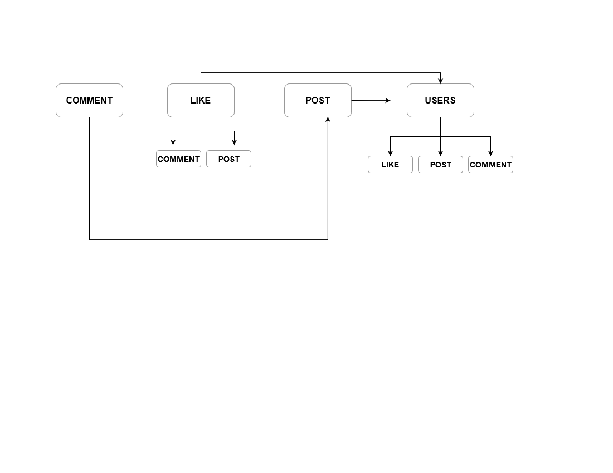

# Backend project 
### create express server via nodeJS with remot mongo DATABASE , 
### package used in this program ==> express ,cors , mongoose , morgan ,dotenv 
#
### there is 5 controllers and routers for =>create , update, get ,get via id ,delete
### only authenticated users can add and crate , and only admins and superUsers can add ,delete ,update, getALL posts
## there also middleware to redirect users with check roles if user have for permission to get ,put ,delete and post
# 
#### check ER Diagram below "_^

